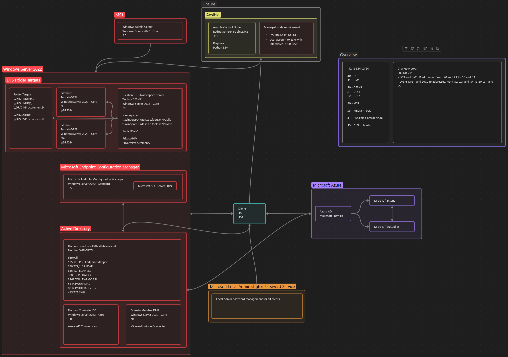

# WindowsOPATestLab

#### Active Directory Domain Services (AD DS)
[For detailed Active Directory configuration, see ADDS.md](Docs/ADDS/ADDS.md)  

#### Dynamic Host Configuration Protocol (DHCP)
[For detailed information on Dynamic Host Configuration Protocol configuration, see DHCP.md](Docs/DHCP/DHCP.md)  

#### Distributed File System (DFS)
[For detailed Distributed File System configuration, see DSF.md](Docs/DFS/DFS.md)  

#### Microsoft Endpoint Configuration Manager (MECM / SCCM)
[For detailed MECM configuration, see MECM.md](Docs/MECM/MECM.md)  
[For MECM pre-reqs, see MECM PREREQS.md](Docs/MECM/MECM%20PREREQS.md)  
[For a MECM standalone walkthrough, see MECM WALKTHROUGH.md](Docs/MECM/MECM%20WALKTHROUGH.md)  
[For MECM Administration, see MECM ADMINISTRATION.md](Docs/MECM/MECM%20ADMINISTRATION.md)  

#### Windows Admin Center (WAC)
[Information about Windows Admin Center can be found in WAC Configuration.md](Docs/Windows%20Admin%20Center/WAC%20Configuration.md)  

## TODO
- [ ] Update code the scripts files.
- [ ] Write a script that checks for the pre-reqs per MECM role. (Multiple scripts for each MECM role?)
- [ ] Expand MECMClientFirewallCheck.ps1. Include firewall configuration.
- [ ] LibreNMS?
- [ ] Zabbix?
- [ ] Veeam?
- [ ] NetBox?

### TrustedHosts
- [ ] IP/Device removal script will leave a comma if the first value in the list is deleted. -> Add an if statement to check for both situations.

### DHCP
- [ ] Check Get-DhcpServerv4Reservation command output

### DFS
- [ ] Primary Member selection with PowerShell
- [ ] Topology selection with PowerShell
- [ ] Replication group scheduling with PowerShell
- [ ] Replication bandwith configuration with PowerShell

### MECM
- [ ] Boundaries and boundary groups
- [ ] User / Device collections
- [ ] Application / Package deployments
- [ ] Discovery Methods